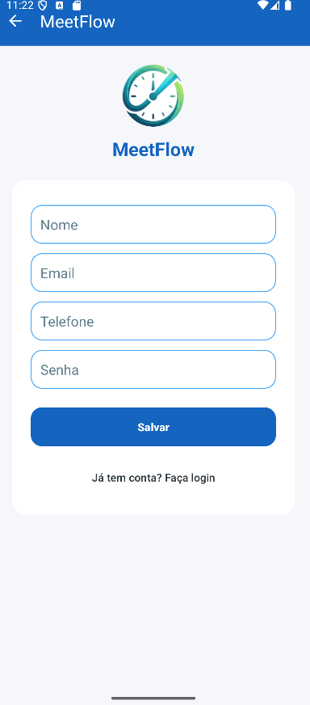
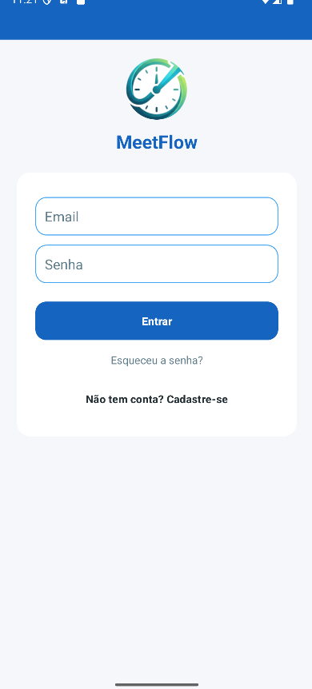
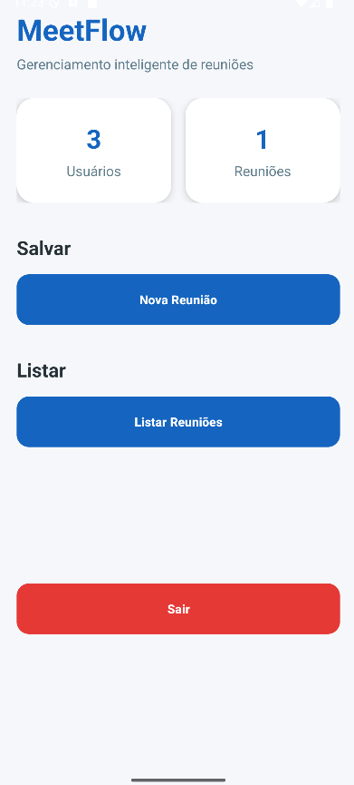
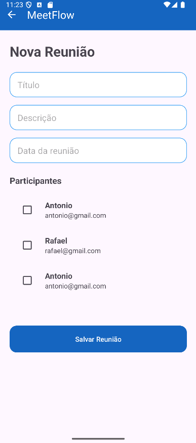
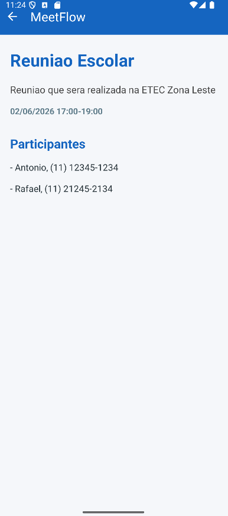

# MeetFlow

Aplicativo Android desenvolvido em Kotlin com SQLite para gerenciamento de reuniões e participantes, utilizando relacionamento N:M (muitos para muitos).

O projeto foi construído com foco em boas práticas de desenvolvimento Android nativo, organização de código e experiência do usuário.

---

# Tecnologias Utilizadas

- Kotlin
- SQLite
- XML Layouts

---

# Funcionalidades

## Usuários
- Cadastro de usuários
- Login de usuários

## Reuniões
- Cadastro de reuniões
- Listagem de reuniões
- Exclusão de reuniões
- Tela de detalhes da reunião

## Relacionamento N:M
- Uma reunião pode possuir vários participantes
- Um usuário pode participar de várias reuniões

## Interface
- Dashboard principal
- Toolbar personalizada
- Navegação entre telas
- Feedback visual com Snackbar
- Empty States
- Material Design

---

# Estrutura do Projeto

```text
com.example.meetflow
│
├── activities
├── adapters
├── database
├── model
├── repositories
├── security
├── session
├── ui
├── utils
├── validators
├── MainActivity.kt
├── res
│   ├── drawable
│   ├── layout
│   └── values
```

---

# Banco de Dados

O projeto utiliza SQLite com as seguintes tabelas:

## usuario
Armazena os usuários do sistema.

## reuniao
Armazena as reuniões cadastradas.

## usuario_reuniao
Tabela intermediária responsável pelo relacionamento N:M entre usuários e reuniões.

---

# Conceitos Aplicados

- CRUD completo
- RecyclerView
- Adapters
- SQLite Relacional
- Relacionamento Muitos para Muitos (N:M)
- Integridade Relacional
- Lifecycle Android
- Material Design
- Navegação entre Activities

---

# Capturas de Tela

## Cadastro de Usuário



---

## Login de Usuário



---

## Dashboard



---


## Cadastro de Reunião



---

## Lista de Reuniões


---

## Detalhes da Reunião



---

# Autor

Antonio Bernardino de Sena Neto

Projeto desenvolvido para fins acadêmicos e de aprendizado em desenvolvimento Android nativo com Kotlin.