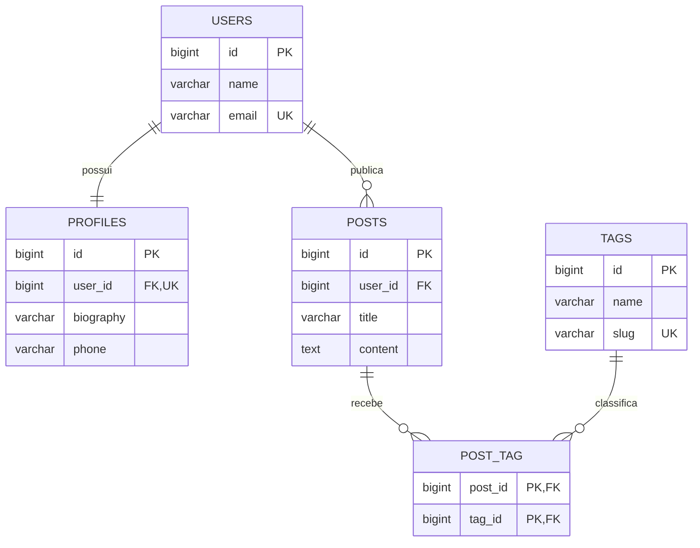

# Relacionamentos com Laravel Eloquent ORM

Projeto Laravel 12 para demonstrar migrations, chaves estrangeiras, índices e relacionamentos 1:1, 1:N e N:M em MySQL.

## Modelo de dados



- `users` e `profiles`: relação 1:1. O índice `UNIQUE` em `profiles.user_id` impede dois perfis para o mesmo usuário.
- `users` e `posts`: relação 1:N. Um usuário pode publicar vários posts.
- `posts` e `tags`: relação N:M por meio da tabela pivô `post_tag`.
- As chaves estrangeiras usam `ON DELETE CASCADE`, mantendo a integridade ao excluir registros relacionados.

## Preparação

Requisitos: PHP 8.2 ou superior, Composer e MySQL 8.

```bash
composer install
copy .env.example .env
php artisan key:generate
```

Configure somente as credenciais locais no `.env`:

```dotenv
DB_CONNECTION=mysql
DB_HOST=127.0.0.1
DB_PORT=3306
DB_DATABASE=ams_laravel_db
DB_USERNAME=root
DB_PASSWORD=(coloque sua senha)
```

---

## Para realizar o teste das migrations, execute o comando:

```bash
php artisan migrate
```
